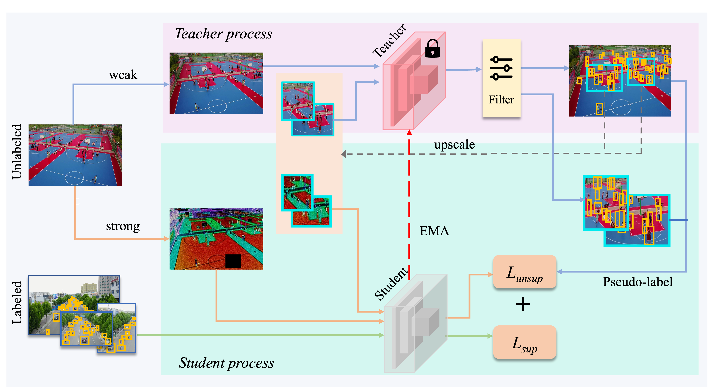
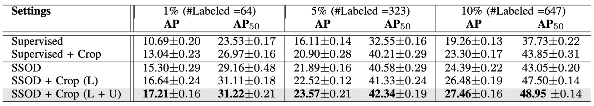
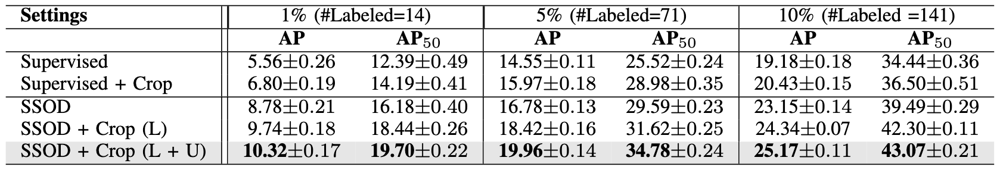

# Density Crop-guided Semi-supervised Object Detection in Aerial Imges

 [](https://opensource.org/licenses/MIT)

This is the PyTorch implementation of our paper: <br>
**Density Crop-guided Semi-supervised Object Detection in Aerial Imges**<br>
Akhil Meethal, Eric Granger, Marco Pedersoli<br>


<p align="center">

</p>

This code base can be used to train the [CZ Detector](https://openaccess.thecvf.com/content/CVPR2023W/EarthVision/papers/Meethal_Cascaded_Zoom-In_Detector_for_High_Resolution_Aerial_Images_CVPRW_2023_paper.pdf) or [QueryDet](https://openaccess.thecvf.com/content/CVPR2022/papers/Yang_QueryDet_Cascaded_Sparse_Query_for_Accelerating_High-Resolution_Small_Object_Detection_CVPR_2022_paper.pdf) in a semi-supervised fashion using the mean-teacher method.

# Installation

## Prerequisites

- Linux or macOS with Python ≥ 3.6
- PyTorch ≥ 1.5 and torchvision that matches the PyTorch installation.
- Detectron2

## Install PyTorch in Conda env

```shell
# create conda env
conda create -n detectron2 python=3.6
# activate the enviorment
conda activate detectron2
# install PyTorch >=1.5 with GPU
conda install pytorch torchvision -c pytorch
```

## Build Detectron2 from Source

Follow the [INSTALL.md](https://github.com/facebookresearch/detectron2/blob/master/INSTALL.md) to install Detectron2.

## Dataset download

1. Download VisDrone dataset

Follow the instructions on [VisDrone page](https://github.com/VisDrone/VisDrone-Dataset)

2. Organize the dataset as following:

```shell
croptrain/
└── datasets/
    └── VisDrone/
        ├── train/
        ├── val/
        ├── annotations_VisDrone_train.json
        └── annotations_VisDrone_val.json
```
The original annotations provided with the VisDrone dataset is in PASCAL VOC format. I used this code to convert it to COCO style annotation: [VOC2COCO](https://github.com/Tony607/voc2coco/blob/master/voc2coco.py).

I am sharing the json files I generated for the VisDrone dataset via google drive below.

a) [annotations_VisDrone_train.json](https://drive.google.com/file/d/1awV0WWScKO7rRdff8mPkn_Q-S261i7Tm/view?usp=sharing)

b) [annotations_VisDrone_val.json](https://drive.google.com/file/d/1SAxFcQDM6txwzK5Itb0sYjxp9i2CYqC4/view?usp=sharing)

3. Download DOTA dataset 

Please follow the instructions on [DOTA page](https://captain-whu.github.io/DOTA/dataset.html). Organize it the same way as above.

## Training

 Train the detector in supervised mode on VisDrone dataset

```shell
python train_net.py \
      --num-gpus 1 \
      --config-file configs/Base-RCNN-FPN.yaml \
      OUTPUT_DIR outputs_Sup
```

 Train the detector in supervised mode using density crops on VisDrone dataset

```shell
python train_net.py \
      --num-gpus 1 \
      --config-file configs/RCNN-FPN-CROP.yaml \
      OUTPUT_DIR outputs_Sup_Dcrop
```

 Train the detector in semi-supervised mode with the vanilla mean-teacher method on VisDrone dataset

```shell
python train_net.py \
      --num-gpus 1 \
      --config-file configs/visdrone/Semi-Sup-RCNN-FPN.yaml \
      OUTPUT_DIR outputs_SSOD
```

 Train the detector in semi-supervised mode with density crop guidance on VisDrone dataset

```shell
python train_net.py \
      --num-gpus 1 \
      --config-file configs/visdrone/Semi-Sup-RCNN-FPN-CROP.yaml \
      OUTPUT_DIR outputs_SSOD_Dcrop
```


## Resume the training

```shell
python train_net.py \
      --resume \
      --num-gpus 8 \
      --config configs/visdrone/Semi-Sup-RCNN-FPN-CROP.yaml \
      OUTPUT_DIR outputs_SSOD_Dcrop MODEL.WEIGHTS <your weight>.pth
```

## Evaluation

```shell
python train_net.py \
      --eval-only \
      --num-gpus 1 \
      --config-file configs/visdrone/Semi-Sup-RCNN-FPN-CROP.yaml \
      MODEL.WEIGHTS <your weight>.pth
```

## Results comparison on the VisDrone dataset
<p align="center">

</p>

## Results comparison on the DOTA dataset
<p align="center">

</p>
## License

This project is licensed under [MIT License](LICENSE), as found in the LICENSE file.
